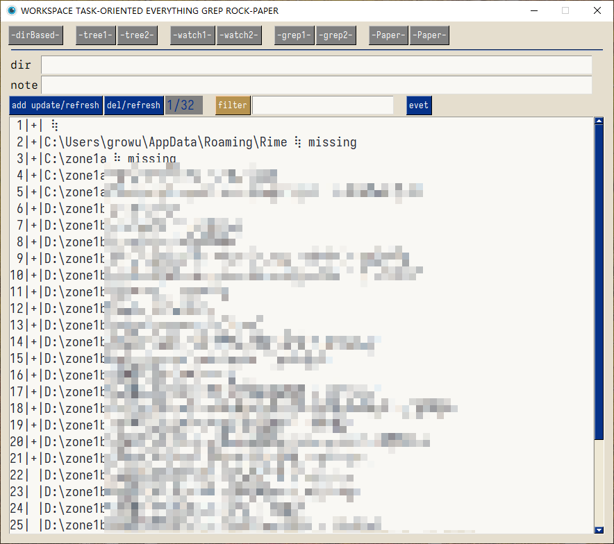
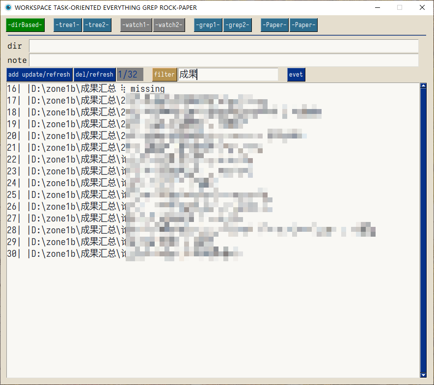
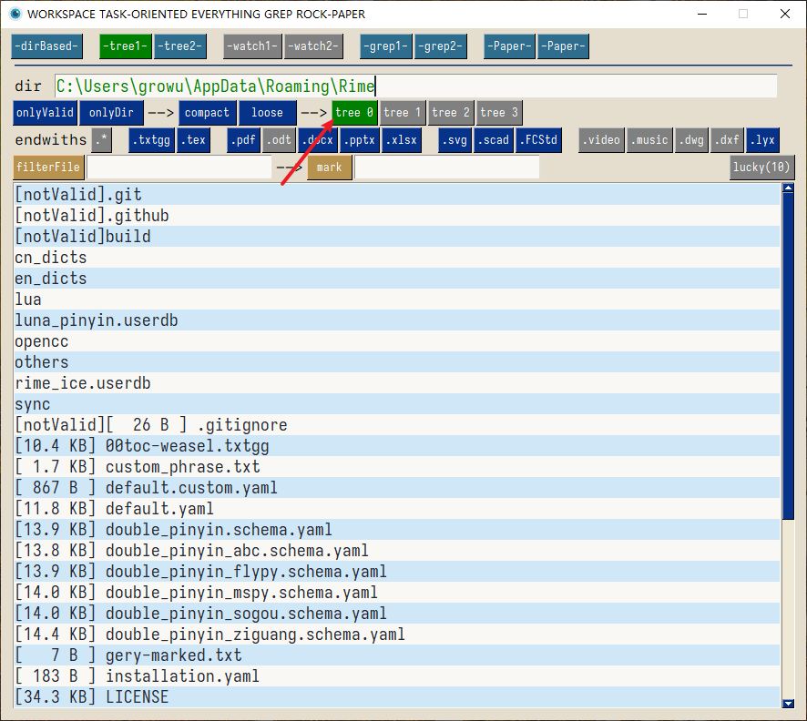
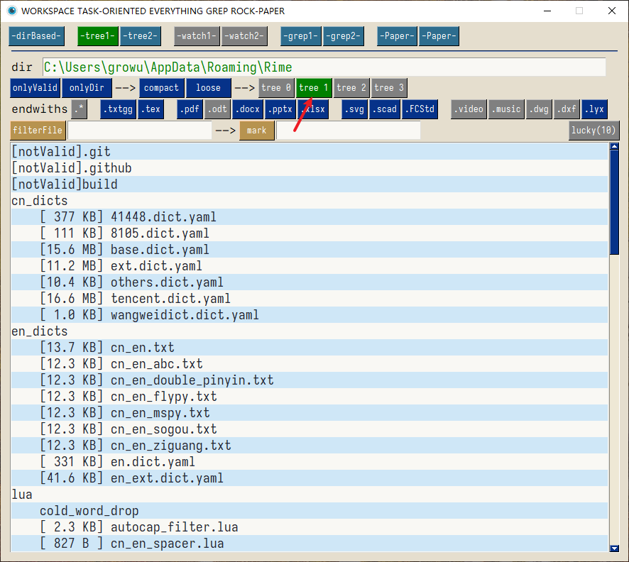
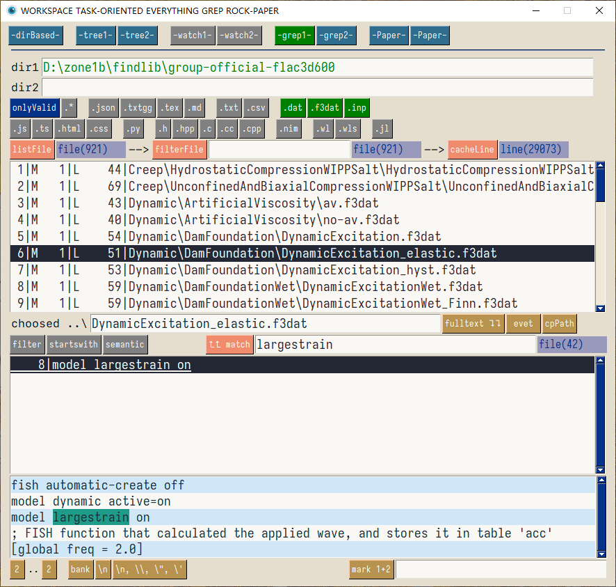
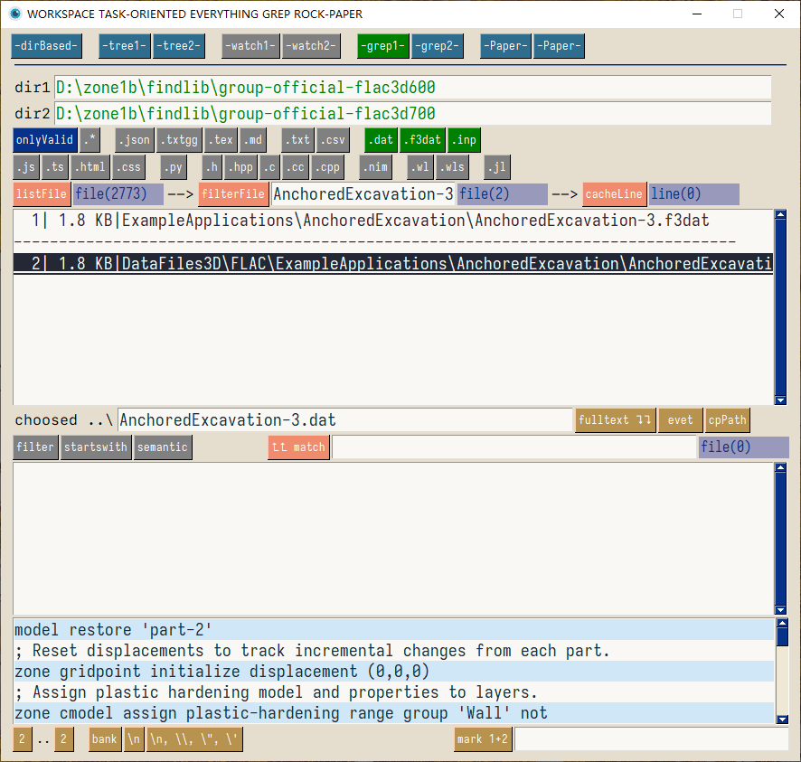
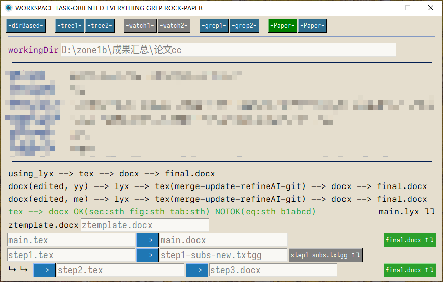

<!--  -->

# ggworkspace

一个基于文件夹的项目追踪、内容检索、论文辅助工具

### 功能

#### 文件夹追踪面板

文件夹追踪，只有先看到才能开展行动。这个功能主要是为了提醒自己重要的值得关注的文件夹，不需要的文件夹应该及时删除。这里不应该是一个仓库。

- 文件夹添加
- 文件夹删除
- 文件夹备注
- 文件夹过滤
- 文件夹存在性检测
- 可以临时存储其他需要提醒的内容

#### 文件夹树形结构面板

#### 文件夹内容检索面板

#### 论文辅助面板

### 安装

从`release`下载压缩文件，解压到任意文件夹，双击 `ggworkspace.exe` 即可。

应用第一次启动后，“可能”会有一个弹窗提示需要`pysimplegui`的授权码。请您到`pysimplegui`的官网注册一个授权码，并复制粘贴到弹窗中，此后便可以正常使用了。

填写授权码的步骤，在一台机器上只需要一次，故您可能需要填写，也可能您已经在其他应用使用期间填写过从而不需要这一步。

### 赞助

本工具使用了 `pysimplegui` 进行开发，但是我没有购买`pysimplegui`的商业许可证，故您需要自己注册授权码。

如果您感觉本工具对您有帮助，可以考虑赞助 :smile:
